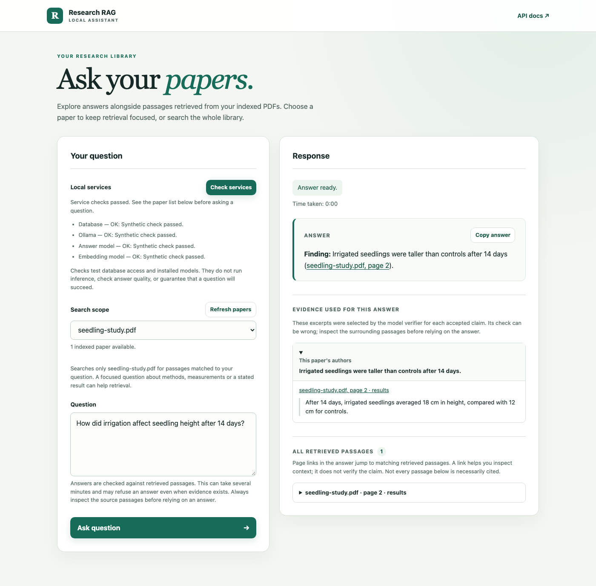
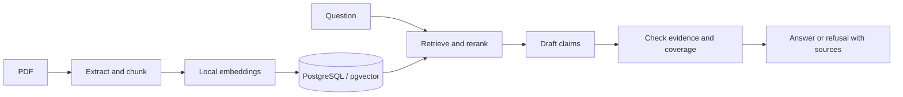

# Research RAG Assistant

Ask questions about academic PDFs and inspect the passages behind each answer.
This local-first research assistant combines semantic retrieval, reranking and
claim-level evidence checks in a FastAPI application with a browser interface.

**Status:** local v1 engineering and AI-assisted development review are complete.
The fresh-question stopping check remains pending; this is an experimental research tool.



*Illustrative UI example using synthetic paper content and a stubbed answer;
this screenshot demonstrates the interface, not model performance.*

## What it does

- Index text-based PDFs while retaining filenames, page numbers and sections.
- Search one paper, top matches across the library, or each paper separately.
- Draft answers, check claims against selected excerpts, and refuse when the
  checks do not establish sufficient evidence.
- Show accepted claim evidence separately from all retrieved passages, with
  page links for inspecting context and a button to copy the answer.

The model's evidence check can be wrong. “Verified” describes the application's
checking process, not independent factual verification.

## How it works



Key engineering choices:

- **Evidence and attribution:** accepted claims retain exact selected excerpts;
  checks distinguish the paper's own findings from cited literature.
- **Safe index replacement:** chunks and processing provenance are saved
  atomically. Failed extraction, embedding or saving preserves the previous index.
- **Bounded local inference:** indexing batches embeddings using one HTTP client;
  each question computes one embedding shared across its paper searches.
- **Regression coverage:** Python tests, JavaScript logic tests, real-browser
  smoke tests, PostgreSQL contracts and strict typing run in CI.

See [architecture and component responsibilities](docs/architecture.md) for the
full data flow, grounding contract and service boundaries.

## Stack

| Component | Technology |
| --- | --- |
| API and browser | Python 3.14, FastAPI, HTML/CSS/JavaScript |
| PDF extraction | PyMuPDF |
| Vector storage | PostgreSQL, pgvector, SQLAlchemy |
| Embeddings and reranking | Ollama `nomic-embed-text`, BGE cross-encoder via sentence-transformers |
| Answer drafting and verification | Ollama `gpt-oss:20b` |
| Environment and checks | uv, Docker Compose, unittest, Node.js, Playwright, mypy |

## Quickstart

The supported local target is **macOS with Apple Silicon**. Install
[uv](https://docs.astral.sh/uv/), Docker with Compose, and Ollama. Keep Docker
and Ollama running. uv can install the project's pinned Python version.
Node.js is needed only for development tests; the UI has no frontend build step.

### 1. Install the application and models

```bash
git clone https://github.com/tristrange/research-rag-assistant.git
cd research-rag-assistant
uv sync --locked
ollama pull gpt-oss:20b
ollama pull nomic-embed-text
```

These are the two Ollama models needed for normal browser use. The BGE reranker
is downloaded on first use if it is not cached. Dependency and model downloads
need internet access; PDF text and questions are processed locally.

### 2. Start and initialize PostgreSQL

Create private credentials, load them into the current terminal, and start the
local database. The `.env` file is ignored by Git. This setup targets a fresh
Docker volume; see [local usage and troubleshooting](docs/local-usage.md) if you
already have a database using port 5432.

```bash
if [ ! -e .env ]; then
  umask 077
  RAG_DB_PASSWORD=$(openssl rand -hex 24)
  printf 'RAG_DB_PASSWORD=%s\nRAG_DATABASE_URL=postgresql+psycopg://rag:%s@localhost:5432/rag\n' \
    "$RAG_DB_PASSWORD" "$RAG_DB_PASSWORD" > .env
fi
set -a
. ./.env
set +a
docker compose up -d
```

Check that PostgreSQL reports `accepting connections` before initializing the
schema. Repeat the readiness check if the container is still starting:

```bash
docker compose exec -T db pg_isready -U rag -d rag
uv run python -m scripts.init_db
```

Source `.env` again in each new terminal before running the API or database
scripts. The application does not load it automatically.

### 3. Index a PDF and open the assistant

Create `data/` and add a text-based PDF you are permitted to use. Replace
`my-paper.pdf` below with its filename; use distinct filenames for distinct papers.
PDFs are ignored by Git and are not included in this repository.

```bash
mkdir -p data
uv run python -m scripts.index_pdf data/my-paper.pdf
uv run uvicorn app.main:app --host 127.0.0.1 --reload --reload-dir app
```

Open [http://127.0.0.1:8000](http://127.0.0.1:8000), choose your paper and ask a
focused question, such as “What methods were used in the study?” Inspect the
selected evidence and surrounding passages. For findings from every indexed
paper, choose **Each paper (overview)**; across-paper top matches may omit papers.

Local generation and verification can take several minutes. The page shows
elapsed time, service checks and recovery guidance. Use **Refresh papers** after
indexing or removing a paper.

## Limitations and safety

- Retrieval uses selected passages, not a complete reading of every paper.
  An insufficient-evidence response does not establish that the paper lacks a result.
- Evidence checks use a language model and can accept unsupported claims or
  reject valid answers. Inspect cited passages before relying on an answer.
- The benchmarks are small development sets with assistant-authored labels.
  Independent human quality review remains outstanding; no general accuracy claim
  follows from the recorded scores.
- Scanned PDFs requiring OCR and advanced cross-paper synthesis are outside local v1.
- The app is unauthenticated and intended for one local user. Keep the API,
  PostgreSQL and Ollama on loopback. PDF text is untrusted; prompt-injection
  defenses reduce risk but do not guarantee prevention.

See the [v1 readiness and validation plan](docs/v1-readiness.md) and
[local security boundary](docs/local-usage.md#local-security-boundary).

## Development

Run the service-independent Python tests, JavaScript tests and type checks:

```bash
RAG_DATABASE_URL=sqlite:///:memory: HF_HUB_OFFLINE=1 TRANSFORMERS_OFFLINE=1 \
  uv run --locked python -m unittest discover -s tests -v
node --test tests/test_ui_rendering.js
uv run --locked mypy
```

JavaScript tests use Node.js 24. Browser binaries and PostgreSQL contract tests
have separate setup steps in the [development guide](docs/development.md).

## Documentation

- [Local usage](docs/local-usage.md): library management, API scopes and troubleshooting.
- [Configuration](docs/configuration.md): model roles, inference settings and environment variables.
- [Architecture](docs/architecture.md): ingestion, retrieval and evidence-checking design.
- [Evaluation](docs/README.md#evaluation-and-validation): benchmark protocols, metrics and results.
- [Documentation index](docs/README.md): development guides and dated engineering studies.
