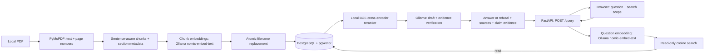

# Local architecture

The supported local product is a FastAPI application, a PostgreSQL/pgvector
index, and Ollama on one machine. FastAPI serves the browser files directly;
there is no frontend build or separate browser server. The normal API path uses
verified answering. Evaluation and internal plain-generation paths are separate.

Both embedding nodes use the same embedding model and validation contract.
Ingestion calls `embed_texts()` for batches; a request-owned `QuestionEmbedding`
calls `embed_text()` once and reuses its vector across searches. Only ingestion
proceeds to index replacement; asking a question reads the stored chunks without
changing the corpus.

## Ingestion and stored data

[`app.ingestion.indexing`](../app/ingestion/indexing.py) owns extraction, chunking,
embedding and atomic replacement. [`scripts.index_pdf`](../scripts/index_pdf.py)
handles terminal arguments, progress output and error messages, and delegates to
the shared application function. The workflow extracts text with PyMuPDF and
retains the PDF's one-based page number. The chunker preserves document, page,
chunk index and recognized section. Its normal target is 500 characters with
100-character overlap, preferring sentence and whitespace boundaries. It does
not perform OCR; scanned PDFs without text are outside local v1.

Chunks are embedded with `nomic-embed-text` in batches of at most 16, using one
HTTP client owned and closed by the indexing operation. The provider validates
the exact response count and every finite 768-value vector before returning a
batch; input order pairs each vector with its chunk. No parallel inference or
automatic retry is introduced. Question embedding keeps the single-text API.
PostgreSQL stores each chunk's text,
metadata and 768-dimensional vector in the `chunks` table. Extraction, chunking
and all embeddings finish before a transaction replaces only rows for that
exact filename. A failed embedding or save preserves the old index. A PDF with
no extractable chunks removes that filename's old rows. Distinct papers need
distinct filenames. Changing extraction, chunking or embeddings requires
reindexing before evaluating the new corpus.

`document_indexes` records each saved PDF checksum and its extraction, chunking
and embedding profile in the same transaction as its chunks. Legacy rows retain
unknown provenance until reindexed. Retrieval checks the selected scope against
the current embedding model name/dimensions before inference, then again under
a shared PostgreSQL transaction advisory lock before vector ranking. Replacements
and removals take the exclusive lock; inference holds no index lock. A unique
index enforces each document/page/chunk location. See the README for migration
recovery and the limits of name-based embedding compatibility.

The CLI reports real stages and completed embedding counts. `Indexed …` follows
the successful commit; completing embeddings alone does not establish a saved
index. PDFs remain local and are ignored by Git.

## Retrieval and answering

[`app.rag`](../app/rag.py) embeds the question, uses pgvector cosine distance to
retrieve vector candidates, then reranks them with the locally loaded
`BAAI/bge-reranker-base` cross-encoder. Normal verified targeted searches retrieve
twenty candidates and retain five reranked passages plus the highest vector-ranked
passage from a document/page absent from those five, within the six-source limit
and without neighbor expansion. If no new page is available, use the highest
vector-ranked unselected passage. This preserves a second selection signal for
cohort and timing details.
With an explicit cutoff, one slot is reserved within that cutoff; a one-source
cutoff or a candidate pool no larger than the cutoff uses ordinary reranking.
Plain answering, vector-only retrieval,
overviews and the opt-in vector-reserve strategy retain their three-passage
defaults. Other reranked paths still retrieve ten candidates. See the
[qualifier retrieval follow-up](qualifier-retrieval.md) for development checks
and limitations.
Each request owns one lazy question embedding, reused across overview section
probes and each-paper searches. Document/section filters, candidate limits and
cosine ordering still run independently for each search. Every search rechecks
index compatibility, including when the vector is already available. The vector
is discarded with the request; identical later questions are embedded again.

The reranker downloads weights from Hugging Face on first use and caches them;
an installed Ollama model does not include the reranker weights.

| Browser scope | Retrieval behavior |
| --- | --- |
| One filename | Search only that paper. |
| Across papers | Retrieve top matches from the library; not every paper is guaranteed to appear. |
| Each paper, targeted search | Retrieve and answer separately for every indexed filename. |
| Each paper, overview | Per paper, try conclusion, abstract, discussion, then results sections; fall back to ordinary search if none has candidates. Merge selected overlapping context. |

Each-paper answering is sequential and can take longer. It labels separate
answers by filename and remaps accepted citation indexes into the combined
source list. Neighbor expansion and the experimental strategy that appends an
extra vector candidate remain opt-in; normal verified targeted searches instead
reserve a vector slot inside their source limit.

[`app.grounding`](../app/grounding.py) asks the configured grounding model for a
structured draft with claims, attribution and citations. The default is
`gpt-oss:20b`: first-draft reasoning low, repair and verification reasoning medium.
Repair reuses the configured verifier reasoning and timeout profile. Runtime
validation checks schema, source references and quoted text; a separate model
call checks claim support, attribution and coverage of the whole question. A
draft-selected quote carries its [evidence ID](repair-evidence.md) in the verifier
input, separately from the passage ID. A
deterministic [duration check](duration-evidence.md) also compares explicit
numeric durations with each claim's verifier-selected quotes. Missing duration
support rejects the claim even when the model approves it. A
rejected draft has at most one repair attempt followed by another check. A
failed evidence check produces the standard insufficient-evidence refusal.
Transport failures, timeouts and output exhaustion are service errors rather
than evidence refusals. [`app.config`](../app/config.py) resolves one immutable
`SETTINGS` snapshot at startup, including model profiles, sampling and per-stage
timeouts. Database, embedding/chat adapters, grounding and diagnostics derive
their settings from it. Compatibility exports preserve evaluation/report imports;
reloading environment variables requires restarting the application.

“Verified” describes these software/model checks, not independent factual truth.
The verifier can miss an unsupported claim or reject a correct answer. It does
not compare runtime questions to stored benchmark answers. Qwen3 8B's evaluation
judge runs in offline evaluation scripts, not in the normal verified query path.

The response contains `answer`, `sources` and `claim_evidence`. The additive
`outcome` field records verified answering or insufficient evidence; each-paper
responses report `partial` when only some
papers were answered. Plain generation with retrieved context leaves the
outcome unknown. The browser uses this field for readiness and retry guidance,
without classifying model prose or claiming independent answer quality.
`sources` is all retrieved context. `claim_evidence` contains only final accepted
claims with
their attribution and verifier-selected excerpts; citation indexes refer to
`sources`. Refusals expose no accepted claim evidence. Browser page links open
the matching retrieved context; inspect that context and the original PDF.

## Maintenance and boundaries

[`scripts.manage_library`](../scripts/manage_library.py) lists filenames and
stored chunk/distinct-indexed-page counts. Removal previews by default and needs
`--yes` to apply an exact-filename transaction. It preserves original PDFs. The
browser's **Refresh papers** rebuilds its selection list after index changes.

`GET /status` checks database/schema access, Ollama connectivity and installed
answer/embedding model tags. It performs no inference, indexing, downloads or
paper-text reads. It does not check the reranker cache or prove that a question
will succeed. Question progress is elapsed browser wait time, not backend stage
reporting or an estimated finish time.

FastAPI enforces loopback clients and local Host headers. PostgreSQL's Compose
port is bound to loopback, and its password comes from the ignored private
`.env`, loaded before starting scripts or the API. Ollama also remains local.
There are no accounts or permissions for multiple users; public deployment is
deferred. One API-process lock rejects overlapping queries with HTTP 429. It is
not a shared lock across multiple worker processes.

PDFs, questions and model output are untrusted data. Prompts distinguish source
content from instructions, structured output and quote checks constrain answers,
and the browser inserts excerpts as text. These defenses do not guarantee that
prompt injection or semantic verification errors are impossible. The model has
no application tools to execute commands or mutate the library. Credentials
are not included in prompts. See the [local security boundary](local-usage.md#local-security-boundary).

Regression CI covers local logic with stubs and SQLite. The
[fresh-install smoke test](install-smoke-test.md) additionally checks live
database/model/browser wiring. Neither substitutes for the deferred human
review and reserved final quality checks in [v1 readiness](v1-readiness.md).
